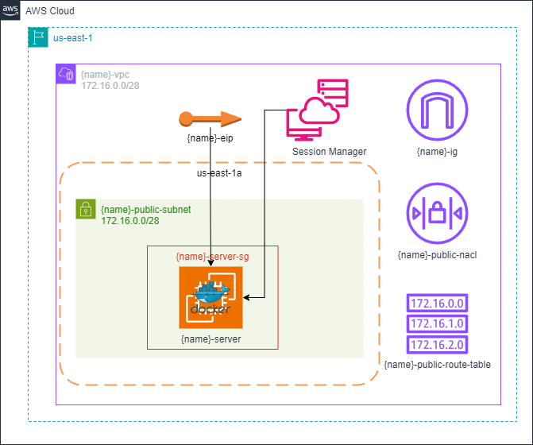

# 1

## Description
This repository contains all the IaC to provision a virtual machine with Docker as the application runner.
It uses the Terraform and AWS cloud provider.

## Diagram
This will be the final result when all the resources have been provisioned:


## Network
A network (VPC) is 28 bits, in other words, 16 addresses are available. 
It has been divided in 1 subnet. 
Therefore, this subnet has 16 addresses.

### VPC
**Addresses:** 
- 172.16.0.0/28

### Subnets
**Address:** 
- 172.16.0.0/28

## Commands
### Requirements
- Linux
- Terraform cli
- Aws cli

> **Warning:** The commands bellow assumes that you are always in root directory, in other words, `Terraform-Training/1` directory.
> Also, was used the `tf` alias.
> For create your alias you can use the following command: `alias tf="terraform"`

### Provisioning infrastructure
- Start the project:
```bash
tf init
```

- Provision the resources:
```bash
# change YOUR_PROJECT_NAME by your project name 
tf apply -var="project_name=YOUR_PROJECT_NAME"
```

- Save the file `terraform.tfstate` that contains all information about your provision resources.

- For test purpose when the virtual machine is created it will create a Nginx container that can be accessed through the http protocol and your Elastic IP. For example: `http://98.0.1.100`. You will see something like this:
 

- You can access the EC2 Instance using the SSM Session Manager through the console using a browser.

- If you think use `sudo docker...` is boring, then add `ssm-user` user to `docker` group:
```bash
usermod --append --groups docker ssm-user
```

- If you change the `user data` script, access the instance and run this command to see the logs:
```bash
sudo cat /var/log/cloud-init-output.log
```

### Destroying infrastructure
- Destroy your resources:
```bash
tf destroy -var="project_name=YOUR_PROJECT_NAME"
```

## References
- [Terraform](https://developer.hashicorp.com/terraform/tutorials/aws-get-started)