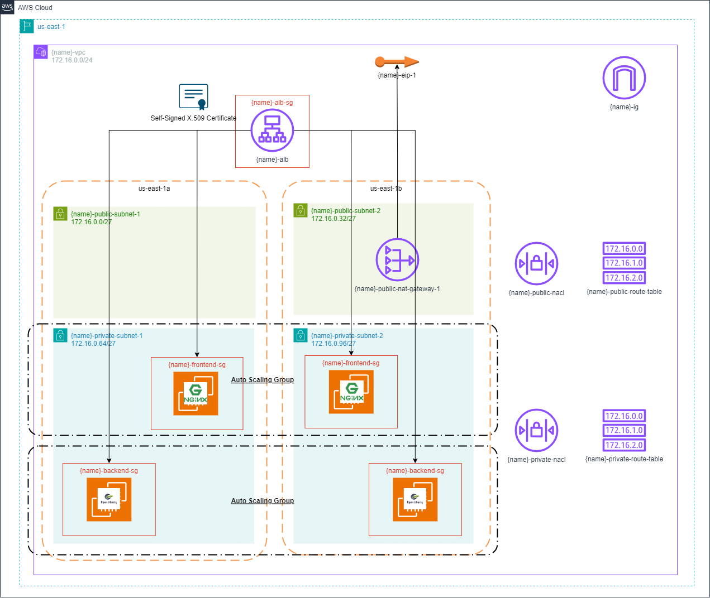

# 2
## Description
This repository contains all the IaC to provision a load balancer backed by virtual machines.
It uses the Terraform and AWS cloud provider.

## Diagram
This will be the final result when all the resources have been provisioned:


## Network
A network (VPC) is 24 bits, in other words, 256 addresses are available. 
It has been divided in 8 subnets. 
Therefore, each subnet has 32 addresses.

### VPC
**Addresses:** 
- 172.16.0.0/24

### Subnets
**Address:** 
- 172.16.0.0/27
- 172.16.0.32/27
- 172.16.0.64/27
- 172.16.0.96/27
- 172.16.0.128/27
- 172.16.0.160/27
- 172.16.0.192/27
- 172.16.0.224/27

## Commands
### Requirements
- Linux
- Terraform cli
- Aws cli

> **Warning:** The commands bellow assumes that you are always in root directory, in other words, `Terraform-Training/2` directory.
> Also, was used the `tf` alias.
> For create your alias you can use the following command: `alias tf="terraform"`

### Provisioning infrastructure
- Start the project:
```bash
tf init
```

- Provision the resources:
```bash
# change YOUR_PROJECT_NAME by your project name 
tf apply -var="project_name=YOUR_PROJECT_NAME"
```

- Save the file `terraform.tfstate` that contains all information about your provision resources.

- Access the applications using your load balancer `DNS name`. Notice that there is a time for the services start, about 5 minutes after instance is created, so wait a few minutes before make requests. 

- The root path like `http://mysite-alb-123456.us-east-1.elb.amazonaws.com` is equals to the frontend server. You will see something like this:


- The root path plus `/api` is equals to the backend server. You will see something like this:


### Destroying infrastructure
- Destroy your resources:
```bash
tf destroy -var="project_name=YOUR_PROJECT_NAME"
```

## References
- [Terraform](https://developer.hashicorp.com/terraform/tutorials/aws-get-started)
- [Nginx](https://nginx.org/en/docs/beginners_guide.html)
- [Open Liberty](https://openliberty.io/guides/getting-started.html#building-and-running-the-application)
- [Open Liberty Maven](https://github.com/OpenLiberty/ci.maven)