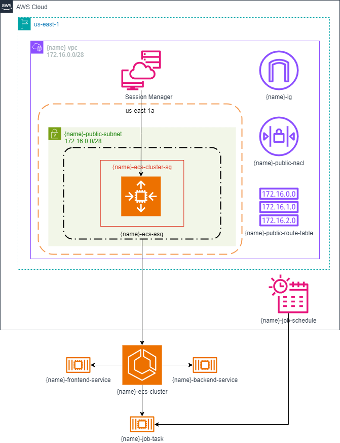

# 3

## Description
This repository contains all the IaC to provision the Amazon Elastic Container Service - ECS.
It uses the Terraform.

## Diagram
This will be the final result when all the resources have been provisioned:


## Network
A network (VPC) is 28 bits, in other words, 16 addresses are available. 
It has been divided in 1 subnet. 
Therefore, this subnet has 16 addresses.

### VPC
**Addresses:** 
- 172.16.0.0/28

### Subnets
**Address:** 
- 172.16.0.0/28

## Commands
### Requirements
- Linux
- Terraform cli
- Aws cli

> **Warning:** The commands bellow assumes that you are always in root directory, in other words, `Terraform-Training/3` directory.
> Also, was used the `tf` alias.
> For create your alias you can use the following command: `alias tf="terraform"`

### Provisioning infrastructure
- Start the project:
```bash
tf init
```

- Provision the resources:
```bash
# change YOUR_PROJECT_NAME by your project name 
tf apply -var="project_name=YOUR_PROJECT_NAME"
```

- Save the file `terraform.tfstate` that contains all information about your provisioned resources.

- You can access the EC2 Instance using the SSM Session Manager through the console using a browser.

- Access the services through the Internet using the HTTP protocol and the EC2 instance public IP. 
The ports available are 8000 for frontend and 8001 for backend. Eg: `http://1.2.3.4:8000` and `http://1.2.3.4:8001`.

- The Job will run every 10 minutes, and you can see the results accessing ECS Service through the console.

### Destroying infrastructure
- Destroy your resources. You need run twice to delete all roles:
```bash
tf destroy -var="project_name=YOUR_PROJECT_NAME"
```

## References
- [Terraform](https://developer.hashicorp.com/terraform/tutorials/aws-get-started)
- [Amazon ECS - Connect application to the internet](https://docs.aws.amazon.com/AmazonECS/latest/developerguide/networking-outbound.html)
- [Amazon ECS - Best practices for receiving inbound connections to Amazon ECS](https://docs.aws.amazon.com/AmazonECS/latest/developerguide/networking-inbound.html)
- [Amazon ECS - Best practices for connecting to AWS Services](https://docs.aws.amazon.com/AmazonECS/latest/developerguide/networking-connecting-vpc.html)
- [Spacelift - How to Deploy an AWS ECS Cluster with Terraform](https://spacelift.io/blog/terraform-ecs)