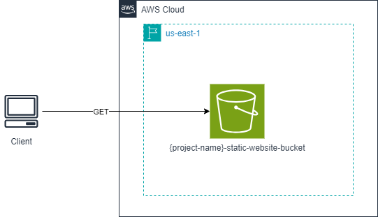

# 4
## Description
This repository contains all the IaC to provision a static website using AWS S3 Bucket.
It uses the Terraform and AWS cloud provider.

## Diagram
This will be the final result when all the resources have been provisioned:


## Commands
### Requirements
- Linux
- Terraform cli
- Aws cli

> **Warning:** The commands bellow assumes that you are always in root directory, in other words, `Terraform-Training/4` directory.
> Also, was used the `tf` alias.
> For create your alias you can use the following command: `alias tf="terraform"`

### Provisioning infrastructure
- Start the project:
```bash
tf init
```

- Provision the resources:
```bash
# change YOUR_PROJECT_NAME by your project name 
tf apply -var="project_name=YOUR_PROJECT_NAME"
```

- Save the file `terraform.tfstate` that contains all information about your provision resources.

- Upload the static files:

```bash
aws s3 cp assets/ s3://YOUR_PROJECT_NAME-static-website-bucket --recursive
```

### Destroying infrastructure
- Empty the bucket:
```bash
# change YOUR_PROJECT_NAME by your project name
aws s3 rm s3://YOUR_PROJECT_NAME-static-website-bucket --recursive
```

- Destroy your resources:
```bash
tf destroy -var="project_name=YOUR_PROJECT_NAME"
```

## References
- [Terraform](https://developer.hashicorp.com/terraform/tutorials/aws-get-started)
- [Emptying a Bucket](https://docs.aws.amazon.com/AmazonS3/latest/userguide/empty-bucket.html)
- [Website Hosting](https://docs.aws.amazon.com/AmazonS3/latest/userguide/WebsiteHosting.html)