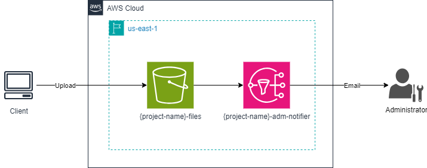

# 5
## Description
This repository contains all the IaC to provision an AWS S3 Bucket and an SNS topic.
It uses the Terraform and AWS cloud provider.

## Diagram
This will be the final result when all the resources have been provisioned:


## Commands
### Requirements
- Linux
- Terraform cli
- Aws cli

> **Warning:** The commands bellow assumes that you are always in root directory, in other words, `Terraform-Training/4` directory.
> Also, was used the `tf` alias.
> For create your alias you can use the following command: `alias tf="terraform"`

### Provisioning infrastructure
- Start the project:
```bash
tf init
```

- Provision the resources:
```bash
# change YOUR_PROJECT_NAME by your project name and YOUR_ADM_EMAIL by your administrator email 
tf apply -var="project_name=YOUR_PROJECT_NAME" -var="adm_email_addr=YOUR_ADM_EMAIL"
```

- Save the file `terraform.tfstate` that contains all information about your provision resources.

- Confirm the email.

- Upload the file:
```bash
# change YOUR_PROJECT_NAME by your project name
aws s3 cp people.csv s3://YOUR_PROJECT_NAME-files
```

- Wait the email.

### Destroying infrastructure
- List the object and your version:
```bash
# change YOUR_PROJECT_NAME by your project name
aws s3api list-object-versions --bucket YOUR_PROJECT_NAME-files 
```

- Remove the object of the bucket:
```bash
# change YOUR_PROJECT_NAME by your project name and OBJECT_VERSION_ID by your object version id
aws s3api delete-object --bucket YOUR_PROJECT_NAME-files --key people.csv --version-id OBJECT_VERSION_ID
```

- Destroy your resources:
```bash
# change YOUR_PROJECT_NAME by your project name and YOUR_ADM_EMAIL by your administrator email
tf destroy -var="project_name=YOUR_PROJECT_NAME" -var="adm_email_addr=YOUR_ADM_EMAIL"
```

## References
- [Terraform](https://developer.hashicorp.com/terraform/tutorials/aws-get-started)
- [Emptying a Bucket](https://docs.aws.amazon.com/AmazonS3/latest/userguide/empty-bucket.html)
- [S3 Event Notifications](https://docs.aws.amazon.com/AmazonS3/latest/userguide/EventNotifications.html)
- [Deleting object versions](https://docs.aws.amazon.com/AmazonS3/latest/userguide/DeletingObjectVersions.html)