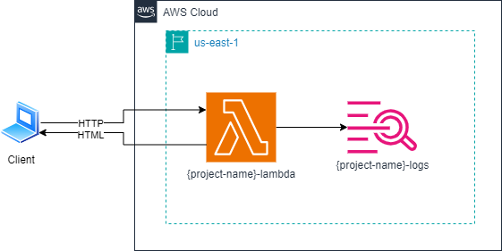

# 6
## Description
This repository contains all the IaC to provision an AWS Lambda.
It uses the Terraform and AWS cloud provider.

## Diagram
This will be the final result when all the resources have been provisioned:


## Commands
### Requirements
- Linux
- Terraform cli
- Aws cli

> **Warning:** The commands bellow assumes that you are always in root directory, in other words, `Terraform-Training/4` directory.
> Also, was used the `tf` alias.
> For create your alias you can use the following command: `alias tf="terraform"`

### Provisioning infrastructure
- Start the project:
```bash
tf init
```

- Provision the resources:
```bash
# change YOUR_PROJECT_NAME by your project name 
tf apply -var="project_name=YOUR_PROJECT_NAME"
```

- Save the file `terraform.tfstate` that contains all information about your provision resources.

- Access the AWS Console and get your Amazon Lambda URL. 

- Use a browser to access it.

### Destroying infrastructure
- Destroy your resources:
```bash
# change YOUR_PROJECT_NAME by your project name
tf destroy -var="project_name=YOUR_PROJECT_NAME"
```

- Access the AWS Console and delete CloudWatch Logs.

## References
- [Terraform](https://developer.hashicorp.com/terraform/tutorials/aws-get-started)
- [Invoking Lambda Function URLs](https://docs.aws.amazon.com/lambda/latest/dg/urls-invocation.html)
- [Build Lambda functions with Node.js](https://docs.aws.amazon.com/lambda/latest/dg/lambda-nodejs.html)
