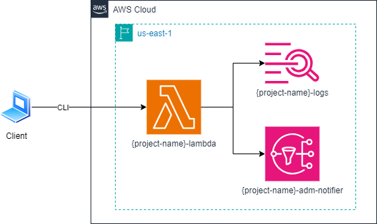

# 7
## Description
This repository contains all the IaC to provision an AWS Lambda that will be called asynchronously.
Also, it has two destinations, one for failure and other for success.
It uses the Terraform and AWS cloud provider.

## Diagram
This will be the final result when all the resources have been provisioned:


## Commands
### Requirements
- Linux
- Terraform cli
- Aws cli

> **Warning:** The commands bellow assumes that you are always in root directory, in other words, `Terraform-Training/4` directory.
> Also, was used the `tf` alias.
> For create your alias you can use the following command: `alias tf="terraform"`

### Provisioning infrastructure
- Start the project:
```bash
tf init
```

- Provision the resources:
```bash
# change YOUR_PROJECT_NAME by your project name and YOUR_ADM_EMAIL by your administrator email
tf apply -var="project_name=YOUR_PROJECT_NAME" -var="adm_email_addr=YOUR_ADM_EMAIL"
```

- Confirm the email.

- Save the file `terraform.tfstate` that contains all information about your provision resources.

- Invoke the function with `SUCCESS` payload:
```bash
# change YOUR_PROJECT_NAME by your project name
aws lambda invoke \
--function-name YOUR_PROJECT_NAME-lambda \
--invocation-type Event \
--cli-binary-format raw-in-base64-out \
--payload '"SUCCESS"' response.json
```

- Wait the email.

- Invoke the function with `FAIL` payload:
```bash
# change YOUR_PROJECT_NAME by your project name
aws lambda invoke \
--function-name YOUR_PROJECT_NAME-lambda \
--invocation-type Event \
--cli-binary-format raw-in-base64-out \
--payload '"FAIL"' response.json
```

- Wait the email.

### Destroying infrastructure
- Destroy your resources:
```bash
# change YOUR_PROJECT_NAME by your project name  and YOUR_ADM_EMAIL by your administrator email
tf destroy -var="project_name=YOUR_PROJECT_NAME" -var="adm_email_addr=YOUR_ADM_EMAIL"
```

- Access the AWS Console and delete CloudWatch Logs.

## References
- [Terraform](https://developer.hashicorp.com/terraform/tutorials/aws-get-started)
- [Invoking a Lambda function asynchronously](https://docs.aws.amazon.com/lambda/latest/dg/invocation-async.html)
- [Capturing records of Lambda asynchronous invocations](https://docs.aws.amazon.com/lambda/latest/dg/invocation-async-retain-records.html)
- [Build Lambda functions with Node.js](https://docs.aws.amazon.com/lambda/latest/dg/lambda-nodejs.html)
